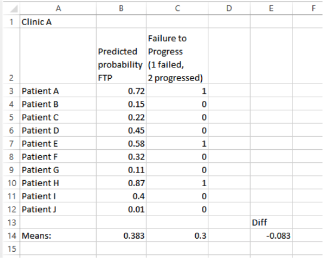

 **ROMS Severity Adjusting**

**Using the Severity Adjustment tables to adjust failure to progress measures.**

There are 2 columns for each outcome measure, the column labels consist of the name of the outcome measure (MDQ, NECK, KOS, LEFS, or DASH) followed by a period (&quot;.&quot;) and then either &quot;prob.mcd&quot; or &quot;prob.pain&quot;. The &quot;prob.mcd&quot; columns are used to predict failure to progress (achieve a minimal clinically important difference, scale specific to the measure) on the outcome measure scale and the &quot;prob.pain&quot; is used to predict a change in the pain scale of at least 2 points (the MCID for pain).

The first column(s) are used to look up the appropriate row for a specific patient. The duration is for duration of symptom, the number of days from injury or surgery to admission. Use the row where the patient&#39;s value lies between the &quot;lower&quot; and &quot;upper&quot; values, if the patients number matches exactly then use the row for which they match the &quot;upper&quot; value, e.g. if the duration is 14 days then use the row for 7 to 14 days rather than the 14 to 30-day row. If this value is missing/unknown because the exact date of injury is not known, then use the row with &quot;Missing&quot; in the lower and upper columns. All other tables have a single row for each possible value, use the row that matches.

The &quot;intercepts&quot; table has only 1 row of values, use the value from this row (and the appropriate column) for all patients.

Look up the appropriate value for each patient on each table, you should get 1 number from each table for each patient and sum up these values. Then put the sum into the following formula:

This is the predicted probability for failure to progress for that patient.

For example, if we have a patient who is a 43 year old Male, admitted with an MDQ score of 48 and a pain score of 7, who has commercial insurance, has 14 days since injury, and conservative treatment, then we would use the following values (these screenshots are for the example, the actual numbers may differ in the tables if the tables have been updated):

Intercepts:


Age:


Sex:


Admit Score:


Pain Score (at admit):


Payer (Insurance) type:


Duration (days since injury/surgery):


Treatment type:


So for this example the sum would be:

-2.65904 + -1.16585 + 0.063434 + 4.3049793 + -0.1756 + -0.0825 + -0.00981 + 0 = 0.2756133

So the final probability for failure to progress for this patient is or 43% chance of failure to progress.

One option for finding the sum for an individual patient is to use an SQL statement if the patient data and the tables have all been loaded into the same database (and the patient data matches the formats for the tables).

Example SQL statement:

```sql
SELECT DISTINCT odi.ID, int.`MDQ.prob.mcd` + admit.`MDQ.prob.mcd` +

pain.`MDQ.prob.mcd` + age.`MDQ.prob.mcd` + pyr.`MDQ.prob.mcd` + sex.`MDQ.prob.mcd` +

txtype.`MDQ.prob.mcd` + dur.`MDQ.prob.mcd`

AS `Predicted Score` FROM intercepts AS int,

`odi.test` AS odi JOIN admit ON odi.ADMIT_SCORE_NO = admit.ADMIT_SCORE_NO

JOIN pain ON odi.ADMIT_PAIN_NO = pain.ADMIT_PAIN_NO

JOIN age ON odi.AGE = age.`Age.num`

JOIN pyr ON odi.pyr2 = pyr.pyr2

JOIN sex ON odi.GENDER_DSC = sex.GENDER_DSC

JOIN txtype ON odi.`TX_TYPE_CD` = txtype.`TX_TYPE_CD`

JOIN dur ON odi.DurCat = dur.DurCat;
```

Another option would be to load all of the tables into an Excel spreadsheet along with the data on the individual patients, then use the VLOOKUP function in Excel to pull the values from each of the lookup tables and do the calculations.

Once we have a predicted failure to progress, we can now look at an actual patient population and determine how the predicted, or &quot;adjusted&quot; failure to progress compares to actual failure to progress, both at the individual patient level as well in the aggregate.

To do the adjustment you need to calculate the predicted probability of Failure to Progress for each patient and an indicator of whether they failed to progress or not (1 means Failure to Progress, 0 means they did progress). Calculate the mean of the predicted probabilities and the mean of the indicators (this second mean is just the proportion who failed to progress). Subtract the mean predicted value from the mean observed value and this is the adjusted value. A value of 0 (zero) is neutral and means that the failure to progress rate matched the predicted failure to progress rate exactly, a negative value means that the actual failure to progress rate was lower than predicted, so more patients in that group progressed than predicted. A positive value means that the observed rate was higher than predicted, so more patients failed to progress than would be predicted by their baseline scores. Below is an example group of patients:



Column B is the predicted values for each patient based on the formula and lookup tables above. Column C just indicates whether each patient failed to progress. For this clinic the predicted failure rate is 0.383 (38.3%) and the actual failure rate is 0.3 (30%) for a difference of -0.083 (-8.3%) meaning that they out performed expectation by 8.3%.
